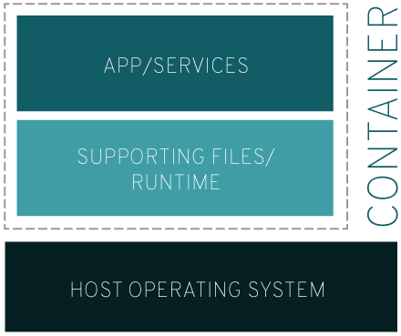

# Linux Container
> 시스템과 격리된 1개 이상의 프로세스 모음 
> 프로세스를 실행하는데 필요한 모든 파일과 라이브러리, 종속성은 개별 이미지에서 제공된다.

### 특징
 - 운영체제 레벨의 가상화 : 별도의 하드웨어 에뮬레이션 없이 리눅스 커널을 공유하고, 게스트 OS 관리가 필요하지 않다.
 - 빠른 속도, 높은 효율 : 하드웨어 에뮬레이션이 없어 빠르고 효율적이다. 프로세스 격리를 위한 약간의 오버헤드를 제외하면 일반 프로세스 실행과 동일하다.
 - Portability, 이식성 : 프로세스 별 독자적인 실행 환경은 이미지 형식으로 공유 가능하며, 리눅스 커널을 사용하고 같은 컨테이너 런타임을 사용하는 타 머신에 이식하기 쉽다.
 -Stateless, 무상태 : 컨테이너가 실행되는 환경은 독립적이며, 다른 컨테이너에게 영향을 주지 않는다. 

### 종류
#### 시스템 컨테이너
 - 호스트 운영체제 위에 하드웨어 가상화 없이 게스트 운영체제를 실행한다.
 - 게스트 운영체제는 일반적인 리눅스처럼 init 프로세스 등을 사용하여 다수의 프로세스가 환경을 공유할 수 있다.
 - 시스템 컨테이너를 지향하는 컨테이너 런타임 : LXC, LSD

#### 애플리케이션 컨테이너
 - 하나의 애플리케이션을 실행한다.
 - 독립적인 환경을 가지는 점에서 시스템 컨테이너와 동일하다.
 - 단 하나의 프로세스만 실행하는 점에서 확장이 쉽고 관리 요소가 거의 없다.
 - 애플리케이션 컨테이너를 지향하는 컨테이너 런타임 : **Docker**

---
##### References
- [Linux 컨테이너란? - RED HAT](https://www.redhat.com/ko/topics/containers/whats-a-linux-container)
- [리눅스 컨테이너란? - 44Bits](https://www.44bits.io/ko/keyword/linux-container)