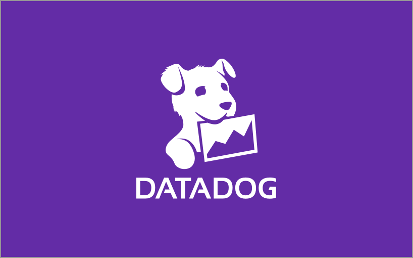
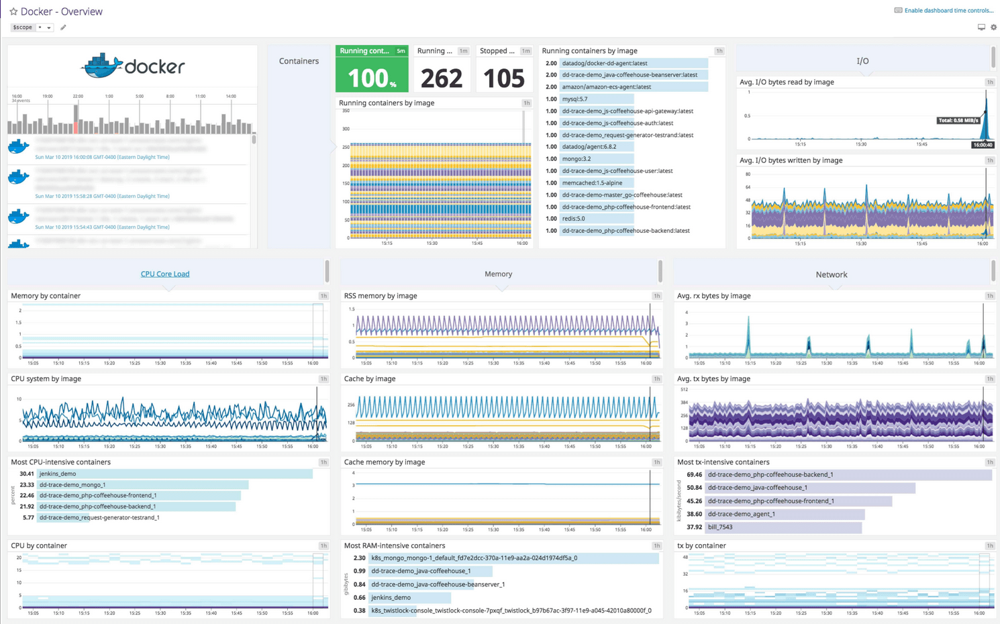

# DataDogs


> 서버, 데이터베이스, 클라우드 서비스 등에 대한 모니터링 서비스를 제공
>
---
## 주요 개념과 서비스

### [DataDog-Agent](https://github.com/DataDog/datadog-agent)
서버에 추가 모니터링을 수행하는 DataDog-Agent.<br>
모니터링 하고자 하는 서버에 설치하여 서버의 메트릭을 가져온다.<br>
추가 설정을 통해 데이터베이스, 메모리 공간에서 추가 메트릭을 수집 할 수 있다.

```2020년 3월 이후 Go 로 개발되고 있다.```

### 인프라 스트럭쳐 모니터링
특정 호스트에 DataDog-Agent를 설치하면 자동으로 서버의 시스템 정보를 수집한다.<br>
무료 플랜에서 5개 호스트까지 모니터링 할 수 있다.<br>

- **인터그래이션**을 통해 서버 외 다양한 서비스를 모니터링 할 수 있다.<br>
AWS, Azure, GCP, Alibaba Cloud, OpenStack 등의 주요 클라우드 서비스를 지원하고,<br>
400 개 이상의 애플리캐이션 및 서비스 연동 인터그레이션을 지원한다.
     - DataDog-Agent의 추가 설정
     - Service API를 통한 연동
<br>

- **APM(Application POerformance Management)**를 애플리케이션 내부에 추가하여 성능을 분석한다.<br>
Java, Python, Ruby, Go, .NET, Node 로 작성된 애플리케이션의 APM을 지원한다.
APM을 활성화하려면 애플리케이션 코드 상에 추가 Setup을 하면 된다.<br>

- **로그 수집 및 모니터링**을 구축할 수 있고, DataDog-Agent에서 로그 수집을 활성화하면 로그를 전송할 수 있다.<br>
Logging Without Limits(무제한적인 로깅) 컨셉으로, 인제스트와 인덱싱으로 나뉜다.**<br>
인제스트는 다양한 형식의 데이터를 관리하기 적절한 표준 형태로 변환해 저장하는 과정이다.<br>
수집된 모든 로그는 인제스트 과정을 거치고, 인제스트 된 로그는 Live Tail로 실시간으로 확인하거나 S3로 다시 내보낼 수 있다.<br>
인제스트 된 로그 중 조건에 따라 인덱싱을 할 수 있으며, 데이터독에서 검색하고 모니터링 용도로 사용할 수 있다.<br>

- **Synthetics 서비스**로 외부에서 Health Check를 할 수 있다.<br>
API 테스트와 브라우저 테스트를 제공한다.<br>
이를 통해 서비스의 업타임을 확인하고, 특정 리전의 접속 문제나 퍼포먼스 이슈를 지속적으로 파악할 수 있다.<br>

- **네트워크 모니터링 기능**을 사용할 수 있다.<br>
트래픽의 흐름을 추적하고 정상적이지 않은 네트워크 현황을 파악할 수 있다.<br>

- **메트릭 기반 대시보드**를 구성하거나 모니터, 알람을 만들 수 있다.<br>
대시보드는 Timeboard와 Screenboard 두 가지 형식으로 나뉘며, 타임보드 형식의 대시보드에선 모든 위젯이 같은 시간 범위를 공유한다.<br>
타임보드 대시보드는 모든 위젯이 같은 시간 범위를 공유하며, 스크린 보드 대시보드는 개별 위젯이 고유한 시간 범위를 가질 수 있고 위젯의 위치를 자유롭게 배치할 수 있다.



---
##### Conference & Summit
- [2024 Dash(Youtube)](https://www.youtube.com/watch?v=7OsdkuezlEY&list=PLdh-RwQzDsaNd5cmcY3ey4QoeyDk6aMKz)
- [Summit](https://www.youtube.com/@DatadogHQ/playlists)

---
##### References
- [Datadog](https://www.datadoghq.com/)
- [44bits Datadogs](https://www.44bits.io/ko/keyword/datadog)