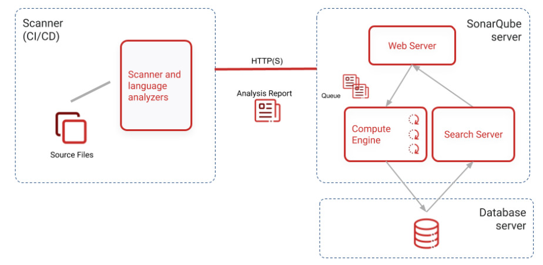
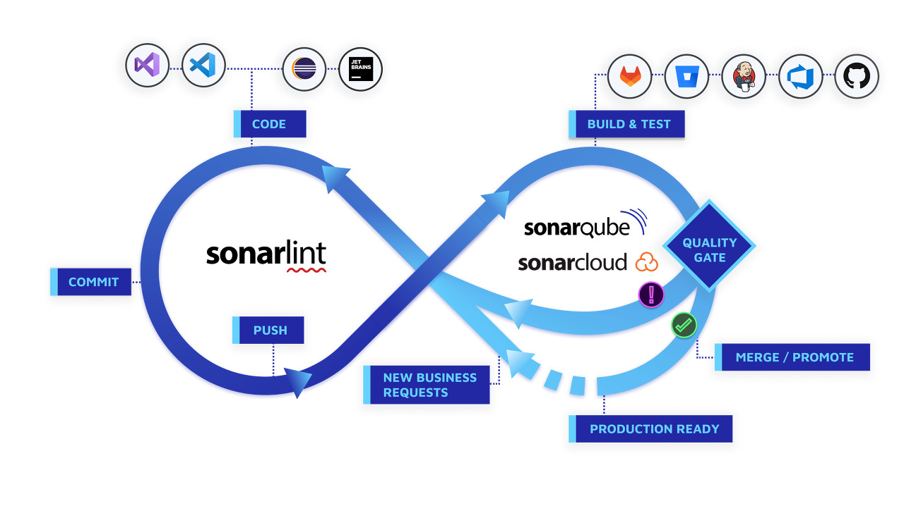

# SonarQube
> 소스 정적 분석 도구
>
### 프로그램 정적 분석(Static Analysis)
프로그램의 실제 실행 없이 코드를 분석한다. 
SonarQube, xLint, PMD,CheckStyle, Findbugs 등의 다양한 오픈 소스가 존재한다. 
이 중 다양한 룰 셋을 사용할 수 있고 플러그인 설치를 통해 다양한 기능을 제공하면서 지속적으로 업데이트 되는 SonarQube를 사용한다. 

### SonarQube Component

1. SonarQube Server : 세 가지 메인 프로세스
    - Web Server : 사용자에게 결과를 보여주고 SonarQube 설정 페이지를 제공한다.
    - Search Server : ElasicSearch 서버를 사용하며 사용자에게 검색 기능을 제공한다.
    - Compute Engine : 정적 분석 결과를 생성하고 SonarQube Database에 저장한다.

2. Database Server : SonarQube의 기본 설정, 프로젝트 분석 스냅샷을 저장한다. 
설정을 통해 [다양한 DB](https://docs.sonarsource.com/sonarqube/latest/setup-and-upgrade/installation-requirements/database-requirements/) 사용이 가능하다.

3. Scanner : 프로젝트 정적 분석을 수행하는 툴로 다양한 형식을 제공하며 CI Server와 연계하여 사용가능하다.

### SonarQube Integration

SonarQube와 ALM 도구가 어떻게 통합되고, SonarQube의 구성요소가 어떻게 사용되는지 보여준다.

1. 코드 작성 후 Sonarlint로 로컬 코드 분석을 실행한다.
2. 분석을 통해 완성한 코드를 SCM으로 Push한다.
3. CI 서버에서 빌드 수행 시 Scanner를 실행하고 결과를 SonarQube로 전송한다.
4. SonarQuber는 분석 리포트 결과를 처리하여 DB에 저장하고 결과를 웹 서버를 통해 제공한다.
5. 웹 페이지에서 분석 결과를 확인하고 코드를 개선한다.

### SonarQube 분석 지표
SonarQube가 코드를 정적 테스트하기 위해서는 언어별 규칙과 이에 해당하는 지표가 존재한다

#### 품질 모델
4가지 유형이 존재하며, 유형(규칙) 구분 방법은 다음과 같다.
> 명백하게 규칙을 어긴 코드이거나 잘못된 코드인가?
- YES -> 신뢰성(버그)...
> 외부 공격자가 악용할 수 있는 코드 규칙이거나 CWE, SANS Top 25, OWASP Top 10에 근간한 규칙인가?
- YES -> 보안성 (취약점, 긴급한 보안 이슈)
> 신뢰성 또는 보안성 규칙이 아닌가?
- 보안 검토성(보안 핫스팟, 잠재적인 보안 이슈)
- 유지 보수성 : 냄새나는 코드, 유지 보수가 힘든 코드

#### 심각도
프로젝트 분석을 위해 규칙의 집합인 Quiality Profile을 사용한다. 
적용된 규칙이 얼마나 심각하고 중요한지 5가지 수준으로 정의한다.
- Blocker 
프로그램의 동작에 영향을 줄 가능성이 높은 버그, 즉시 수정해야한다. 
    - 메모리 누출, 닫히지 않은 JDBC 연결 등
- Critical 
프로그램의 동작에 영향을 줄 가능성이 낮은 버그 또는 보안 결함, 즉시 수정해야한다. 
    - 빈 Catch 블록, SQL Injection 등
- Major 
개발자 생산성에 영향을 크게 줄 수 있는 품질 결함으로 시간을 두고 검토해야 한다. 
    - 중괄호로 덮혀있지 않은 코드, 중복 코드, 사용되지 않은 매개 변수
- Minor 
개발자의 생산성에 잠재적인 영향을 미칠 수 있는 품질 결함
    - 너무 긴 코드, 3개 미만의 switch 문 등
- Info 
버그 또는 품질 결함이 아닌 알림

#### 모델 품질 등급
Reliability(Bug)
- A : 0개 버그
- B : Minor 버그 존재시
- C : Major 버그 존재시
- D : Critical 버그 존재시
- E : Blocker 버그 존재시

 

Maintainability(Code Smell)
> Technical Dept, 코드를 수정하는데 걸리는 시간이 프로그램 전체 Debt의..
- A : 5% 미만
- B : 6 ~ 10%
- C : 11 ~ 20%
- D : 21 ~ 50%
- E : 50% 초과

 

Security Review(Security Hotspot)
> 검토된 Security Hotspot 비율이...
- A : 80% ~
- B : 70% ~ 80%
- C : 50% ~ 70%
- D : 30% ~ 50%
- E : ~ 30%

 

복잡도, 문서화, 중복 수치는 분석 언어에 따라 결과 값이 다르다. 
[Metric Definition](https://docs.sonarsource.com/sonarqube/latest/user-guide/metric-definitions/)

### SonarQube 에 대처하는 법
- 가장 최근에 발생한 문제부터 접근하기
- Duplication 먼저 제거하기
- SonarQube 분석 주기는 매일 수행하기

---
##### References
- [소스 정적 분석도구 SonarQube 9.9v](https://brunch.co.kr/@joypinkgom/207)
- [Golang 테스트 커버리지 측정과 코드 정적 분석 그리고 SonarQube](https://www.popit.kr/golang-%ED%85%8C%EC%8A%A4%ED%8A%B8-%EC%BB%A4%EB%B2%84%EB%A6%AC%EC%A7%80-%EC%B8%A1%EC%A0%95%EA%B3%BC-%EC%BD%94%EB%93%9C-%EC%A0%95%EC%A0%81-%EB%B6%84%EC%84%9D-%EA%B7%B8%EB%A6%AC%EA%B3%A0-sonarqube/)
- [인프런 개발 파트 소개](https://tech.inflab.com/20240422-be-part/)
- [sonarqube docker image](https://hub.docker.com/_/sonarqube)
- [소나큐브 설치하기 (with Docker, macOS)](https://jonghoonpark.com/2023/08/02/install-sonarqube-with-docker-in-local-macos)