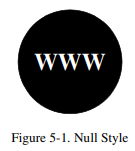
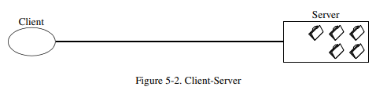
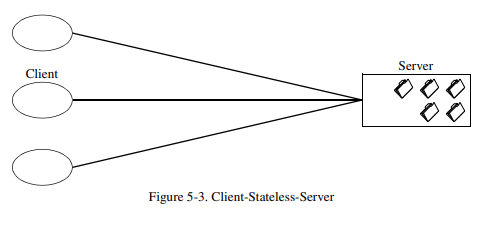
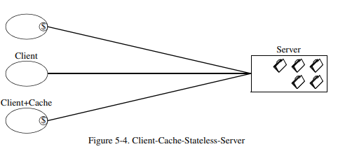
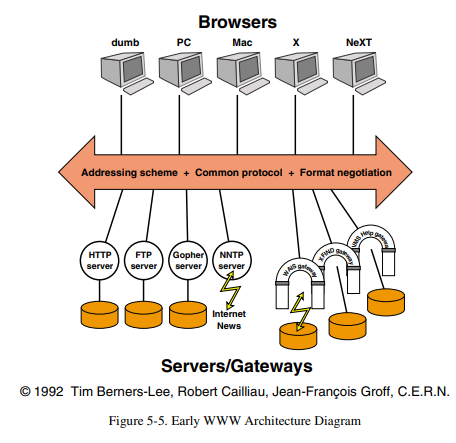
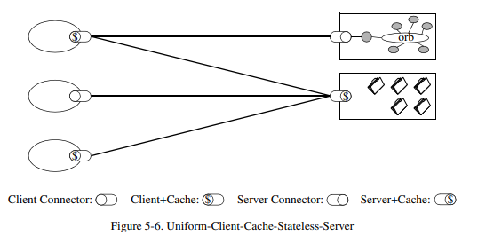
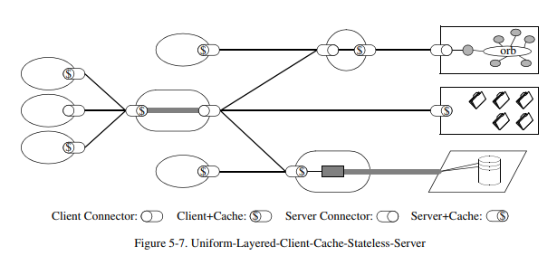
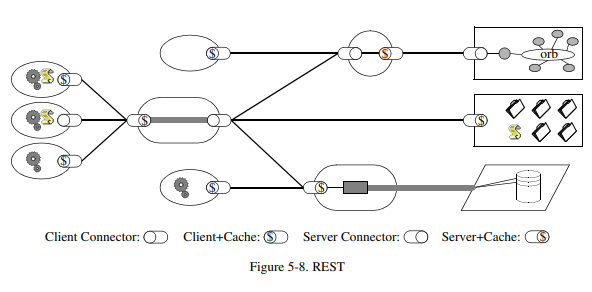

# REST
>  **Re**presentational **S**tate **T**ransfer <br>
>  컴포넌트 간 상호작용 설계 가이드라인

REST 문서 목표 : 각 개념 이해
---
- 상호작용의 확장성: 시스템이 증가하는 부하를 처리할 수 있는 능력
    - 클라이언트-서버 구조 : 서버는 클라이언트의 상태 정보를 관리하지 않아 클라이언트가 증가해도 서버의 부하가 증가하지 않는다.
    - 계층 구조 : 로드 밸런서를 이용하여 트래픽을 여러 서버로 분산하듯, RESTful 시스템은 여러 계층으로 구성될 수 있으며, 각 계층은 독립적으로 확장될 수 있다.

- 인터페이스의 일반성 : 다양한 클라이언트가 시스템과 상호작용 할 수 있게 하는 표준 제공
    - 통일 인터페이스 : HTTP 메서드(GET, POST, PUT, DELETE) 등을 사용하여 리소스와 상호작용한다.
        - GET 요청: 특정 리소스를 조회
        - POST 요청: 새로운 리소스를 생성
        - PUT 요청: 기존 리소스를 업데이트
        - DELETE 요청: 특정 리소스를 삭제
    - 자체 메세지 : 각 요청에는 메세지 포멧(JSON, XML)이 포함되며, 서버는 별도의 문서 없이 요청을 이해하고 처리할 수 있다.
    - 하이퍼미디어 제어 : 클라이언트는 리소스의 상태를 변경하거나 탐색할 때 하이퍼링크를 사용하여 서버가 제공하는 다양한 리소스와 동적으로 상호작용 가능

- 구성 요소의 독립적인 배치 및 축소를 위한 중간 구성 요소 상호 작용 지연 : 중간 구성 요소를 이용한 시스템 성능 향상과 배포 유연성
    - 프록시 & 게이트웨이 : 요청과 응답 사이에 위치한 중간 구성 요소는 보안, 로드 밸런싱, 캐싱 등의 기능을 제공하고 성능과 확장성을 높힌다.
    - 서비스 분리 : 서비스를 서로 독립적으로 배포할 수 있어 각 서비스가 개별적으로 개발, 배포, 확장될 수 있다.
    - 지연 상호작용 : 캐시 등의 중간 구성 요소들은 요청과 응답 사이에서 작업을 수행하며 서버에 대한 요청을 줄이고 응답 시간을 줄인다.

- 보안 강화 : 데이터의 무결성, 기밀성, 인증 및 권한 부여 보장
    - HTTPS 사용 : 데이터가 전송 중 암호화된다.
    - 인증 및 권한 부여 : OAuth, JWT 등의 매커니즘을 사용하여 사용자 인증 및 권한 부여를 처리한다.
    - 입력 검증 : 클라이언트가 서버에 보내는 모든 데이터는 검증되어야하며, SQL 인젝션, XSS 등과 같은 보안 취약점 방지을 방지해야한다.

- 레거시 시스템 캡슐화 : 기존 레거시 시스템과 신규 시스템의 통합 시 캡슐화 사용
    - REST API Wrapping : 레거시 시스템의 기능을 RESTful API로 캡슐화하여 시스템이 현대적인 방식으로 상호작용 할 수 있다.
    - 점진적 마이그레이션 : 단계적으로 RESTful 구조로 전환시, 시스템을 완전히 재구성하지 않고도 새로운 기능과 호환성을 유지할 수 있다.
    - 캡슐화 : 레거시 시스템은 RESTful API를 통해 캡슐화되며 클라이언트는 레거시 시스템의 내부 구현을 모르더라도 기능을 활용할 수 있다.

- 소프트웨어와 네트워크의 접점 및 네트워크 기반 소프트웨어 이해 : 소프트웨어 컴포넌트와 네트워크 간 상호작용을 관리하는 방법
    - 클라이언트-서버 모델 : 클라이언트가 UI 담당, 서버가 데이터 저장 및 처리 기능을 담당한다.
    - 상태 비저장성 : 서버는 클라이언트의 상태를 저장하지 않는다. 모든 요청은 독립적으로 처리된다. 서버의 확장성이 높아진다.
    - 리소스 중심 설계 : REST는 리소스 중심으로 설계된다. 각 리소스는 고유한 URL로 식별되고 클라이언트는 HTTP 메소드를 통해 조작한다.

CHAPTER 5 Representational State Transfer (REST)
---
 > 분산 하이퍼미디어 시스템을 위한  Representational State Transfer (REST) 아키텍처 스타일 <br>
 > 

### Deriving REST
#### Starting with the Null Style
<br>
Null 스타일은 제약이 없는 아키텍처이며 구성 요소 간에 명확한 경계가 없는 시스템을 나타냅니다.<br>
Null Style에서 제약 조건을 추가하며 REST를 설명한다.

#### 제약 1 : Client-Server
<br>
 - 서버는 데이터를 저장한다.
 - 클라이언트는 UI를 구성한다.
 - 결과적으로 클라이언트의 인터페이스 이식성과 서버의 확장성을 향상시킨다.

#### 제약 2 : Stateless
<br>
 - 서버와 클라이언트 간 통신은 무상태이다. 서버에 저장된 컨택스트를 사용할 수 없다.
 - 서버는 클라이언트의 상태를 저장하지 않는다.
 - 세션 상태는 전적으로 클라이언트에 의해 유지된다.
 - 가시성, 신뢰성, 확장성을 향상시킨다.
    - Visibility : 모니터링 시스템이 전체적인 요청을 파악하기 위해 단일 요청 외 다른 시스템을 볼 필요 없다.
    - Reliability : 실패 복구가 용이하다.
    - Scalability : 요청 간 상태를 저장할 필요가 없어 서버 자원을 빠르게 해제할 수 있고, 요청에 대한 정보를 관리할 필요 없기 때문에 구현이 단순하다.

#### 제약 3 : Cache ( Client-Cache-Stateless-Server (C$SS) 사용 )
<br>
 - 응답 데이터가 캐시 가능한지 여부를 암시/명시적으로 표기해야한다.
 - 응답 데이터가 캐시 가능한 경우 동일한 요청에 응답 데이터를 재사용 할 수 있다.
 - 네트워크 효율성(efficiency), 확장성(scalability), 사용자 만족도(userperceived performance)를 향상시킬 수 있다.
 - 단 오래된 데이터를 캐시했다면 신뢰성을 감소시킬 수 있다.

#### 제약 4 : Uniform Interface
<br>
 - 시스템의 모든 컴포넌트가 동일한 인터페이스를 사용하여 통신한다.
    - 일반성(Generality) : HTTP 표준 메서드(GET, POST, PUT, DELETE)를 사용하는 것에서 나타난다.<br>
    웹 API가 데이터베이스에서 정보를 가져오거나, 새로운 데이터를 추가하거나<br>
    기존 데이터를 업데이트 또는 삭제 시 HTTP 메서드를 동일하게 사용한다.
    - 가시성(Visibility) : 요청과 응답이 HTTP 표준을 따르므로 네트워크 상의 모든 요청과 응답은 명확하고 일관적이다.

#### 제약 5 : Layered System
<br>
 - 컴포넌트 간 인접한 계층 이상을 확인할 수 없도록 제한한다.
 - 전체 시스템의 복잡도를 줄이고 독립성을 증가시킨다.
 - 계층 구조는 레거시 시스템을 캡슐화하고, 레거시 클라이언트로부터 새로운 서비스를 보호할 수 있다.
 - 중개 컴포넌트를 통해 캐시, 로드 밸런싱이 가능하며 시스템의 확장성을 향상시킬 수 있다.
 - 단 네트워크 통신과 데이터 처리에 오버헤드와 지연이 심화되어 성능이 감소할 수 있다.

#### 제약 6 : Code-on-Demand(선택 제약이나 2024 기준 웹 브라우저엔 모두 적용되어있다...)
<br>
 - 클라이언트가 서버로부터 동적으로 코드를 받아 실행할 수 있도록 하는 방식이다.<br>
 웹 브라우저의 JavaScript, SPA(Single Page Application) 프레임워크의 React, Angular, Vue.js 등이 있다.
 - 클라이언트는 더 적은 기능만 구현해도 되며, 필요한 기능은 서버로부터 동적으로 받아 확장할 수 있다.
 - 클라이언트는 서버에서 실행할 코드를 받아오므로 보안과 신뢰성이 중요하다.
 - 클라이언트가 어떤 코드를 받을지 예측하기 어렵기 때문에 시스템의 동작을 파악하기 힘들어져 가시성이 감소한다.


### REST Architectural Elements
REST는 3가지 컴포넌트의 역할에 초점을 둔다.<br>
컴포넌트의 세부 구현에 초점을 두는게 아니다.
#### 1. Data Elements
 - 특성과 상태를 가진다.
 - Type
    - Resource : 고유하게 식별되는 모든 객체와 데이터, URI(Uniform Resource Identifier) 통해 접근 가능하다. 이름을 가진 모든 정보는 모두 리소스가 될 수 있다.
    - Representation : 리소스는 클라이언트와 서버 간 데이터를 주고받기 위해 특정 형식으로 표현된다. 리소스의 현재 상태를 나타내고 XML, JSON, HTML 등의 형식을 가질 수 있다.
    - Links : RESTful에서 하이퍼미디어 요소는 리소스 간 관계를 나타내는 링크다. <br>
    링크는 하이퍼텍스트를 통해 리소스 간 탐색을 가능하게 한다.
        - 사용자 프로필 리소스는 관련된 주문 목록 리소스에 대한 링크를 포함할 수 있습니다. ```{"id": 123, "name": "John Doe", "orders": "/users/123/orders"}```와 같은 데이터에서 "orders" 필드는 사용자가 가진 주문 목록에 대한 링크를 제공한다.
 - Data Element 설계 옵션
    - 데이터 중심 접근 : 데이터는 서버(중앙)에서 저장되고 관리된다. 클라이언트는 데이터를 조회, 조작하기 위해 서버에 요청을 보낸다.
    - Code-on-Demend : 서버는 클라이언트에게 필요한 코드를 전송하여 클라이언트 측에서 실행하게 한다.
    - Processing Agent Movement : 분산 시스템에서 특정 작업이나 데이터 처리를 효율적으로 수행하기 위해, 데이터를 요청한 쪽에서 처리하기보다 **데이터를 보유한 쪽**으로 프로세싱 코드를 이동시켜 데이터를 처리한다.

#### 2. Connector : 구성 요소와의 상호작용에 대한 제약
 - 클라이언트와 서버 간 상호작용을 관리하는 역할을 가진 구성 요소이다.
 - 통신 프로토콜
    - HTTP(S) 프로토콜을 주로 사용한다.
 - 인터페이스
    - 일관된 인터페이스를 사용하여 상호작용을 단순화하고 가시성을 높힌다.<br>
    모든 리소스는 동일한 HTTP 메서드로 접근된다.
 - 상태 표현(State Representation) : Connector 는 시스템 내의 상태를 클라이언트와 서버 간 교환 할 수 있도록 한다. 요청과 응답 메세지를 통해 이루어진다.
 - 자원 식별(Resource Identification) : URI(Uniform Resource Identifier)를 사용하여 시스템의 자원을 식별한다. 각 리소스는 고유의 URI를 가지고 클라이언트는 특정 리소스를 식별하고 접근할 수 있다.
    - 예시 : ```/products/50```는 ID가 50인 특정 제품을 나타내는 URI이다.

#### 3. Data : 데이터를 구조화하고 해석하는 방식
 - 데이터는 리소스의 상태와 표현을 포함하며 서버 간 상호작용의 핵심이다.
 - 리소스 상태(Resource State) : 리소스의 현재 데이터 값, 서버에서 관리되고 클라이언트에서 요청을 통해 읽거나 변경할 수 있다.
 - 표현(Representation) : 리소스의 상태는 클라이언트와 서버 간 교환시 특정 형식으로 표현된다. 일반적으로 JSON, XML, HTML 이 있다.
    - 예시 : ```{"id": 123, "name": "John Doe", "email": "john.doe@example.com"}```와 같은 JSON 데이터는 사용자의 상태를 표현한다
 - 데이터 교환(Data Exchange) : HTTP 요청 및 응답을 통해 데이터를 교환한다.
 - 메타데이터(Meta Data) : 데이터의 해석을 돕거나 데이터의 사용을 관리하는 추가적인 정보이다.
    - 예시 : ```Content-Type : application/json``` 헤더는 메타데이터의 일반적인 예시다. 서버가 클라이언트에게 응답 데이터가 JSON 형식임을 알리고 있다.

---
###### References
- [Architectural Styles and
the Design of Network-based Software Architectures(Roy Thomas Fielding)](https://ics.uci.edu/~fielding/pubs/dissertation/top.htm)
- [논문 해석](https://steady-life.tistory.com/226)
