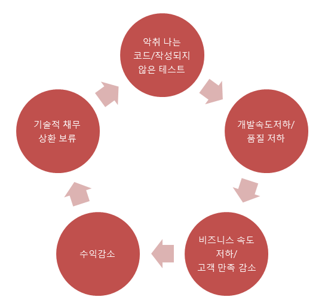
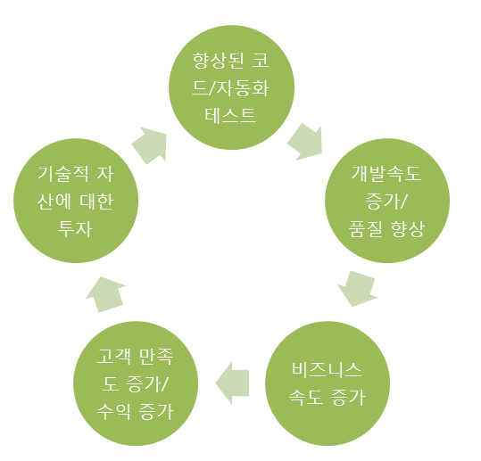

# Technical_Debt
> Technical_Debt, 기술 부채 
악취 나는 코드, 테스트 커버리지, 적절하지 못한 객체 모델링 
현 시점에서 더 오래 소요될 수 있는 더 나은 접근방식을 사용하는 대신 쉬운(제한된) 솔루션을 채택함으로써 발생되는 추가적인 재작업의 비용을 반영하는 소프트웨어 개발의 한 관점이다.
>

Ward Cunningham이 비기술자들에게 문제를 전달하기 위해 사용한 단어 
간단히, 꼭 해두지 않더라도 프로젝트가 끝날 때까지 티나지 않은 작업을 지칭한다.

#### 악순환과 선순환
 
- 예시 : 코드 가독성을 높이기 위해 릴리즈 일정을 조정해주세요? -> 불가능 

기술 부채는 소프트웨어를 사용하는 엔드 유저에게 직접적인 가치를 제공하지 않는다. 
그로 인해 관리 업무에서 흔히 소외되는 요소 중 하나이다.

기술적 부채는 빌린 사람과 갚는 사람이 일치하지 않는다. 
빌린 사람은 최초 개발자, 갚는 사람은 표면상 유지 보수 개발자, 본질적으로는 시스템 소유자(또는 프로젝트 오너)다.

금융 부채와 마찬가지로 적절하게 컨트롤된다면 기술 부채가 반드시 부정적이지 않다. 
프로젝트 진행에 상당한 융통성과 진행도를 가져다준다. 
단 제대로 인지하고 관리하지 않는다면 프로젝트나 비즈니스를 망치는 심각한 문제가 된다.  

대표적인 기술 부채 종류들
---
- 문서화 하지 않은 설계
- 제거하지 않은 미사용 DB 항목
- 긴급한 스펙 변경
- 누락된 자동화 빌드&테스트(유닛 테스트)
    - 제때 작성해두지 않거나, 부실하게 작성되어 실행 패턴에 대한 커버리지가 부족한 자동화 테스트
    - 버그의 처리 비용은 생성 후 얼마나 빠른 시간 내에 처리되냐에 달려있다.
    - 반면 테스트 케이스를 작성하고 Jenkins 등의 CI Tools과 함게 한다면 채무와 반대되는 의미의 기술 자산이라 할 수 있다.
- 리팩토링 
    - 소스 코드 가독성 증가
    - 객체 지향 프로그래밍을 위한 객체 모델링 작업
        - 예시 : 트랜잭션 스크립트 패턴 -> 도메인 모델링 패턴
        - 한번에 완벽한 모델을 만드는건 쉽지 않으므로 모델 변경과 구현의 사이클을 반복해야한다.
    

Conclusion
---
**기술 부채를 해결할 것인가?**
- 얼마의 노력이 드는가?
- 얻는 가치는 무엇인가?
- 비즈니스 문제를 미뤘을 때 어떤 문제가 생기는가?

기술 채무는 개발자가 게을러서 발생하는 것이 아니며, 스케쥴 진행 상 거의 필수 불가결하게 발생한다.  
적절하게 관리된다면 프로젝트 진행에 상당한 융통성을 가져다 줄 것이다.

##### References
- [Technical Debt](https://ko.wikipedia.org/wiki/%EA%B8%B0%EC%88%A0_%EB%B6%80%EC%B1%84)
- [Managing Technical Debt](https://www.infoq.com/articles/managing-technical-debt/)
- [기술적 부채에 대처하는 자세 Ver2.0](https://www.moreagile.net/2013/10/blog-post.html)
- [기술 부채 : 아름다운 쓰레기와 사상 누각 사이](https://brunch.co.kr/@leehosung/2)